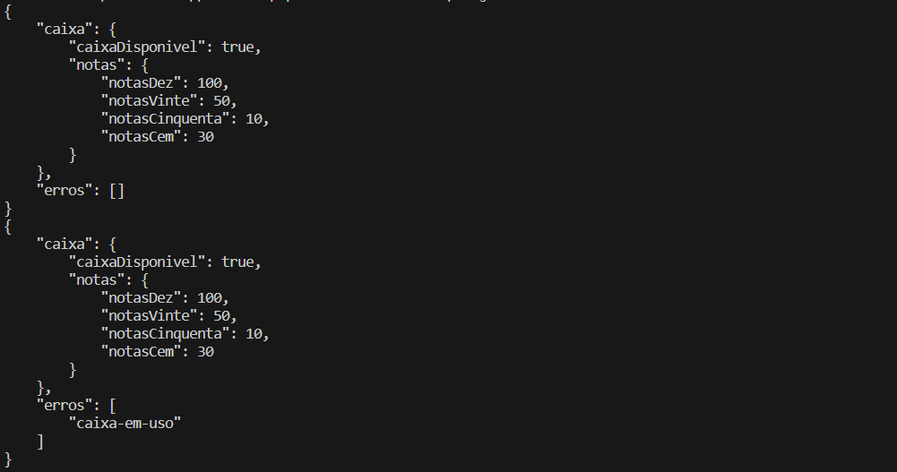
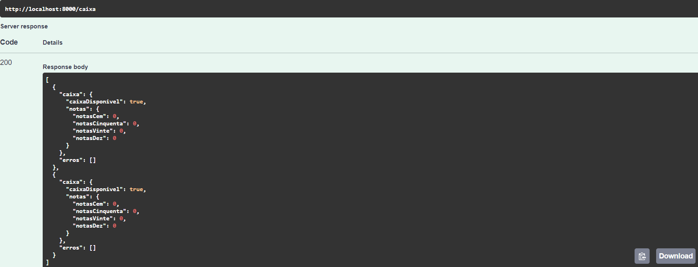

# LocaWeb - Caixa Eletrônico

Esse é meu teste lógico para a vaga de programador Sênior Backend PHP na empresa [LocaWeb](https://www.locaweb.com.br).

  

## Tecnologias Utilizadas

- Backend

- PHP

- PHPUnit

- Laravel

- Swagger

- Docker

  

Foi utilizado a estrutura de containers (Docker) na aplicação, para realizar o build do projeto basta abrir o terminal e navegar até o diretório do mesmo. Logo após é necessário executar o comando. `docker compose up -d` que irá criar o container e baixar as dependências.

  

Foi utilizado o PHPUnit para realizar testes unitários solicitados na documentação fornecida pelo recrutador. Para isso, basta executar no terminal o comando `docker compose exec app php artisan test` que será exibido o resultado.

  

Existem duas formas de testar a aplicação. Através do **terminal** ou através da **api** que foi desenvolvida também.

  

Para realizar os testes através do terminal, precisam ser informadas as entradas dentro do arquivo **input.json** que se encontra na raíz do diretório.

Obs.: Podem ser informadas mais de uma entrada como no exemplo acima.

  

Após salvar as alterações do arquivo, execute `docker compose exec app sh -c "php artisan caixa < input.json"` que os testes serão realizados e retornados para o usuário como no exemplo abaixo.

Obs.: Para realizar o próximo teste, basta alterar a(s) entrada(s) no arquivo **input.json** e executar novamente o comando.

  

A outra forma de testar a aplicação é através da **api**. Para isso, basta acessar o endereço **http://localhost:8000/api/documentation/** que contém toda a documentação criada com o Swagger.

  

Os testes podem ser realizados diretamente pelo Browzer através do método ***POST***, de uma forma mais prática. Para isso, basta escolher a opção desejada *(/caixa/abastecer ou /caixa/sacar)* e logo em seguida clicar no botão ***Try it out***.

  

Será exibida uma interface de entrada com um json padrão, mas o usuário pode alterá-lo para realizar os testes. Ao clicar no botão ***Execute*** a api retornará o json *(stdout)* e o código de resposta (**200** = Sucesso, **400** = Erro).

